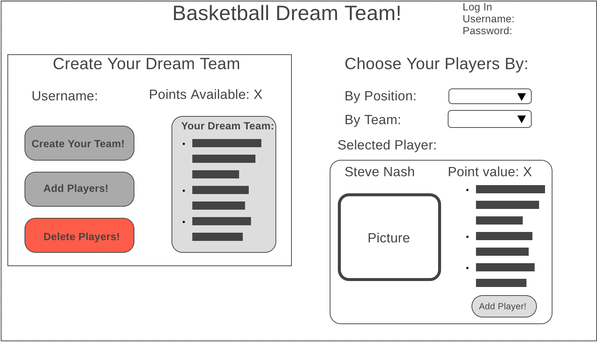
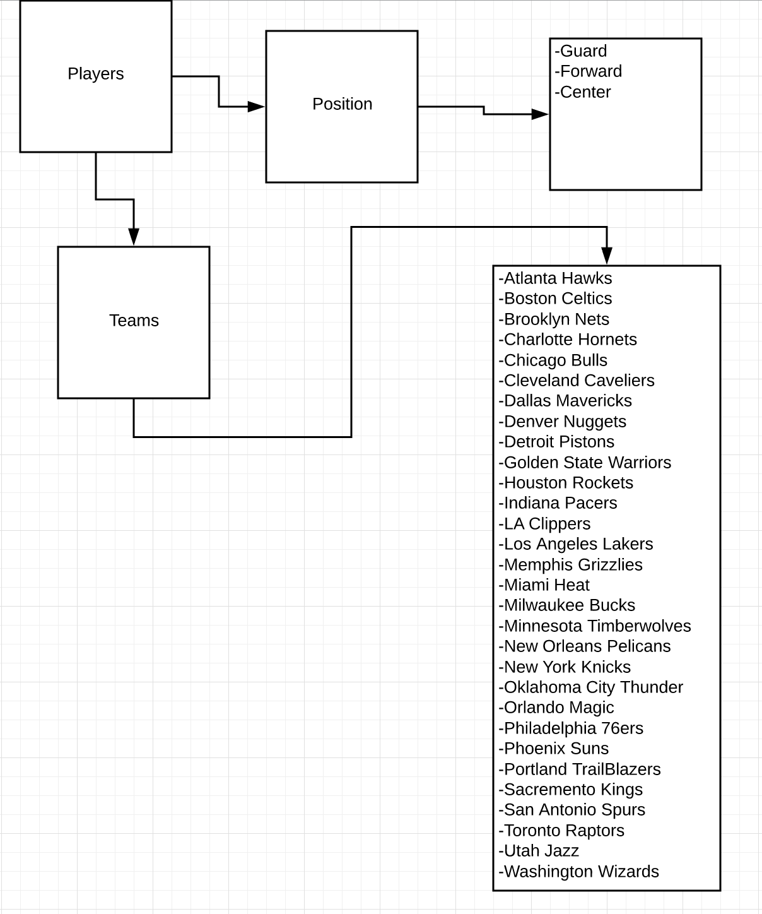
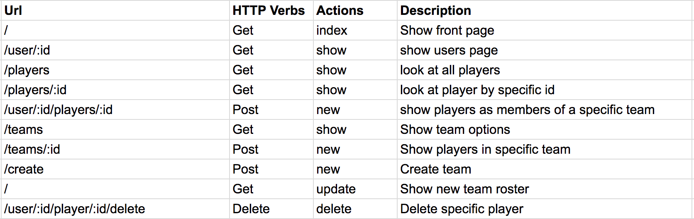

# Basketball Dream Team!
Project 2: Aleena Madni

## Description:
Create your NBA Dream Team:
Each User will have x amount of points to create a dream team with players that all have different points. You create a team and can add and delete players to make the perfect team. The database will only have the best players from each team but from 1990s (maybe late 80s as well, haven’t decided) and up. So they’ll be a guards dB, forwards dB, centers dB. So you can create a mix of players. Basically like a virtual basketball card game. You create a sick team to show off

How it works:

So the User starts off with 500 points and build their team so like Lebron James will be 100 points while Chris Paul will be 50 points!

## WireFrame:

## Database ERD (Entity Relationship Diagram):

## Routes:

## Trello Link:
[Trello](https://trello.com/invite/b/ac88LBZ3/cf36e3b8ac7c49f6be7862f12c538224/basketball-dream-team)
